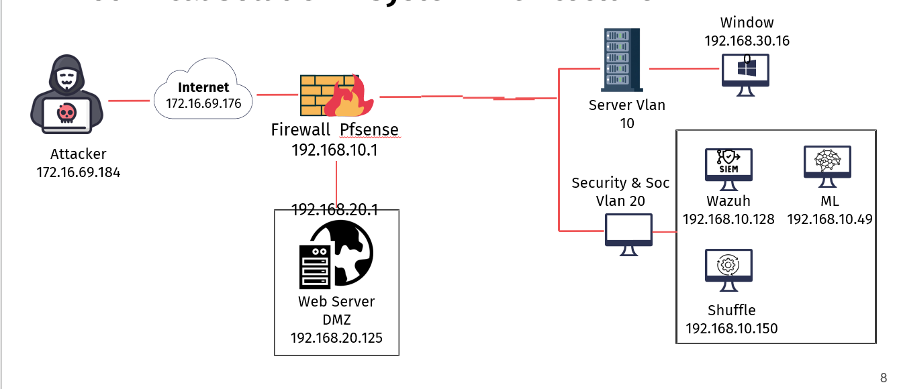
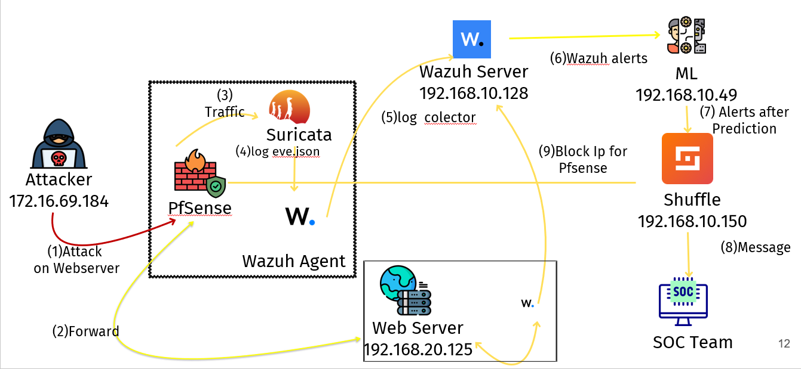
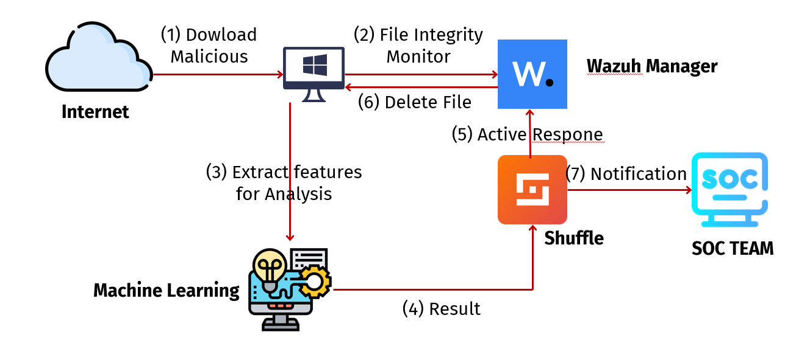

# Smart SOC A Machine Learning Integrated Platform for Alert Prioritization and Threat Orchestration

Smart SOC is a security operations prototype that combines SIEM alert analytics, SOAR response workflows, and machine-learning-based malware analysis into one integrated platform. The project focuses on reducing alert fatigue by ranking Wazuh alerts by operational priority, detecting suspicious PE files with an EMBER-style LightGBM model, and forwarding high-confidence findings to response systems such as Shuffle, pfSense, and Telegram.

## Key Capabilities

- **SIEM alert prioritization:** Normalizes raw Wazuh alerts and predicts `P1` to `P4` priority levels using extracted rule, network, HTTP, Suricata, and attack-pattern features.
- **Malware analysis with ML:** Extracts static PE features and performs LightGBM inference against an EMBER2024-style malware detection model.
- **SOAR orchestration:** Sends important malware and alert-priority results to Shuffle webhooks for downstream playbooks.
- **Automated threat response:** Supports pfSense alias updates for source-IP blocking and Telegram notifications for analyst awareness.
- **Unified FastAPI service:** Exposes one combined API for malware prediction, alert priority inference, batch prediction, Wazuh ingest, health checks, and model metadata.
- **Data preparation utilities:** Converts Wazuh Dashboard CSV exports into JSON-lines suitable for model training and inference experiments.

## Architecture

The project is demonstrated in a segmented SOC lab that separates the attacker network, DMZ services, server VLAN, and security/SOC VLAN. The three diagrams below document the lab topology and the two primary detection and response flows.

### Smart SOC Lab Network Topology



This topology shows the main lab zones and IP addressing:

- Attacker host: `172.16.69.184`
- Internet gateway segment: `172.16.69.176`
- pfSense firewall: `192.168.10.1`
- DMZ web server: `192.168.20.125`
- Server VLAN 10 with Windows endpoint: `192.168.30.16`
- Security/SOC VLAN 20 with Wazuh `192.168.10.128`, ML service `192.168.10.49`, and Shuffle `192.168.10.150`

### Web Attack Alert Prioritization And Response Flow



This flow explains how web attacks are detected and prioritized:

1. The attacker targets the web server.
2. Traffic is forwarded through pfSense to the DMZ web server.
3. Suricata observes the traffic and generates security events.
4. Wazuh Agent collects logs such as `eve.json`.
5. Wazuh Server receives and correlates the collected logs.
6. Wazuh alerts are sent to the ML service.
7. The ML service predicts alert priority and forwards high-risk results to Shuffle.
8. Shuffle sends notification messages to the SOC team.
9. For high-priority cases, Shuffle can trigger pfSense blocking actions.

### Malware Analysis And Active Response Flow



This flow explains the malware analysis workflow:

1. A Windows endpoint downloads a malicious file from the Internet.
2. Wazuh File Integrity Monitoring detects the file event.
3. PE features are extracted and sent to the machine learning analysis service.
4. The ML service returns a malware prediction result.
5. Shuffle coordinates active response with Wazuh Manager.
6. Wazuh deletes the malicious file from the endpoint.
7. Shuffle notifies the SOC team about the detection and response action.

## System Flow

```text
Wazuh / SIEM Alerts
        |
        v
Alert Feature Extractor -----> Alert Priority ML Model ----+
                                                            |
PE File / Endpoint Sample -> PE Feature Extractor ----------+--> Combined ML API
                                                                 |
                                                                 +--> Shuffle SOAR
                                                                 +--> pfSense block list
                                                                 +--> Telegram notification
```

## Repository Structure

```text
.
|-- combined_ml_server.py          # Unified FastAPI service for malware + alert priority inference
|-- ml_server.py                   # Standalone malware detection API
|-- pe_extractor_service.py        # Flask service for PE static feature extraction
|-- model.py                       # EMBER-style feature vectorization and LightGBM training utilities
|-- alert_priority/
|   |-- alert_priority_server.py   # Standalone Wazuh alert priority API
|   |-- convert_wazuh_csv.py       # Wazuh CSV to JSON-lines conversion utility
|   `-- feature_extractor.py       # Stable feature extraction for Wazuh/SIEM alerts
|-- docs/
|   `-- images/                    # Lab topology and workflow diagrams
|-- requirements.txt
`-- .env.example
```

Large binary artifacts such as trained `.model`, `.joblib`, `.pkl`, logs, virtual environments, and presentation files are intentionally excluded from this repository. Place model files locally and point the services to them with environment variables.

## API Overview

| Endpoint | Method | Purpose |
| --- | --- | --- |
| `/health` | `GET` | Combined service health and model availability |
| `/model-info` | `GET` | Combined malware and alert-priority model metadata |
| `/predict-features` | `POST` | Malware prediction from a 2560-dimensional PE feature vector |
| `/predict` | `POST` | Priority prediction for one Wazuh alert |
| `/predict-batch` | `POST` | Batch priority prediction for multiple alerts |
| `/ingest/wazuh` | `POST` | Wazuh ingest endpoint with optional response orchestration |
| `/malware/model-info` | `GET` | Malware model metadata |
| `/alert-priority/model-info` | `GET` | Alert-priority model metadata |

## Quick Start

1. Create and activate a Python virtual environment.

```bash
python -m venv .venv
.venv\Scripts\activate
```

2. Install dependencies.

```bash
pip install -r requirements.txt
```

3. Copy the environment template and configure local paths or integrations.

```bash
copy .env.example .env
```

4. Add trained model artifacts locally.

```text
./ember2024_pe_lgbm.model
./alert_priority/models/alert_priority_model.joblib
```

5. Start the combined service.

```bash
uvicorn combined_ml_server:app --host 0.0.0.0 --port 8000
```

6. Optionally start the PE extractor service.

```bash
python pe_extractor_service.py
```

## Configuration

The platform is configured through environment variables. Important options include:

| Variable | Description |
| --- | --- |
| `ML_MODEL_PATH` | Path to the EMBER2024 LightGBM malware model |
| `ALERT_PRIORITY_MODEL_PATH` | Path to the trained alert-priority `.joblib` model |
| `ML_INGEST_API_KEY` | Optional API key required by Wazuh ingest |
| `SHUFFLE_MALWARE_WEBHOOK` | Shuffle webhook for malware detection events |
| `SHUFFLE_RESPONSE_WEBHOOK` | Shuffle webhook for alert response orchestration |
| `PFSENSE_ALIAS_URL` | pfSense API alias endpoint used for IP blocking |
| `PFSENSE_API_KEY` | pfSense API key |
| `TELEGRAM_BOT_TOKEN` / `TELEGRAM_CHAT_ID` | Telegram notification target |

## Security Notes

- Do not commit `.env`, API keys, webhook URLs, trained model binaries, raw logs, or internal lab exports.
- Tune thresholds before production use to match local false-positive tolerance and response policy.
- Keep automated blocking behind analyst-approved policies or limited lab allowlists until validated.
- Treat this repository as a research and capstone implementation, not a drop-in managed SOC product.

## Project Scope

This project demonstrates how machine learning can support SOC workflows by combining:

- SIEM telemetry normalization from Wazuh.
- Alert scoring and prioritization for analyst triage.
- Static malware analysis using PE features and LightGBM.
- SOAR-style response hooks for enrichment, notification, and containment.


